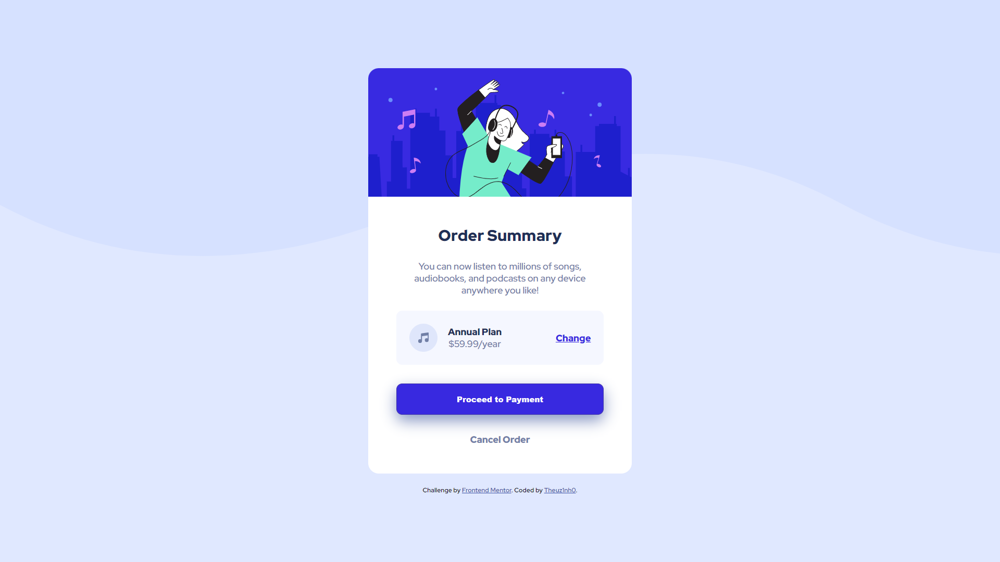

## Table of contents

- [Overview](#overview)
  - [The challenge](#the-challenge)
  - [Screenshot](#screenshot)
  - [Links](#links)
- [My process](#my-process)
  - [Built with](#built-with)
- [Author](#author)

## Overview

### The challenge

Users should be able to:

- See hover states for interactive elements

### Screenshot

### Links

- Solution URL: [solution URL](https://github.com/Theuz1nh0/order-summary-card/)
- Live Site URL: [live site URL](https://theuz1nh0.github.io/order-summary-card/)

## My process

### Built with

- Semantic HTML5 markup
- Flexbox

## Author

- Frontend Mentor - [@Theuz1nh0](https://www.frontendmentor.io/profile/Theuz1nh0)
- Linkedin - [@theuz1nh0](https://www.linkedin.com/in/theuz1nh0/)
